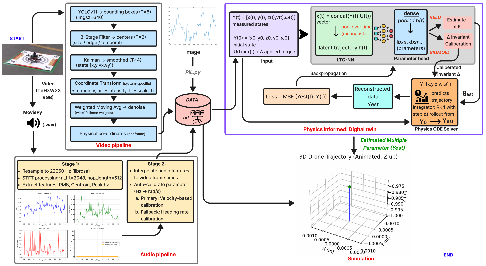

# EMMA: Extracting Multiple physical parameters from Multimodal Data

**CVPR 2026**

[Farhat Shaikh](https://scholar.google.com/citations?hl=en&user=mbAOSW0AAAAJ), [Ayan Banerjee](https://scholar.google.com/citations?user=UAlc7tEAAAAJ&hl=en), [Sandeep K. S. Gupta](https://scholar.google.com/citations?user=U9bcQkMAAAAJ&hl=en)

**IMPACT Lab, School of Computing & Augmented Intelligence (SCAI), Arizona State University**

[**Project page**](https://impactlabasu.github.io/EMMA-CVPR2026/) · [**Demo video**](https://youtu.be/Uo79pVlM6Rk)

---

## Overview

EMMA is a physics-informed multimodal framework that recovers all identifiable dynamical parameters of a system directly from raw video, audio, and image-based time-series observations. Unlike prior video-only approaches that struggle with occluded states, hidden actuation inputs, and assumptions about known initial conditions, EMMA performs joint inference of **explicit parameters**, **implicit dynamical components**, and **calibration invariants** within a unified continuous-time model.

The user supplies the parametric structure of the governing ODE; EMMA solves the inverse problem of recovering its parameters, along with any latent forcing and invariants, from multimodal observations.

## Key contributions

- **Multi-modal dynamical parameter extraction** from video, audio, and time-series reconstructed from visual charts.
- **Recovery under unobserved forcing inputs** by inferring latent actuation (e.g. wheel speed) from audio.
- **Estimation of implicit dynamics** associated with unmeasured physical effects (e.g. frictional drag).
- **Invariant calibration from raw video**, eliminating assumptions about known initial conditions or coordinate frames.
- **Extensive validation** on 100+ scenarios: Delfys benchmark (75 videos), real-world rover and quadrotor, and simulation charts.

## Architecture

<p align="center"></p>

EMMA follows a three-step pipeline: **Sense · Learn · Verify**.

1. **Sense.** Video, audio, and chart images are converted into time-aligned signals through modality-specific pipelines.
2. **Learn.** A Liquid Time-Constant (LTC) network models the system's latent dynamics in continuous time.
3. **Verify.** A differentiable ODE solver simulates the recovered parameters and checks them against the observations under a physics-informed loss.

## Results

EMMA delivers accurate multi-parameter recovery across diverse physical systems. Full tables and ablations are in the [paper](docs/42612.pdf).

| System | Parameters recovered | EMMA error | Best baseline |
|--------|----------------------|------------|---------------|
| Pendulum (90 cm) | Length *L*, damping *τ* | **L = 0.86 ± 0.07 m** (GT 0.90) | Delfys, PySINDy |
| Torricelli (med.) | Drainage *k* | **0.0132 ± 0.0008** (GT 0.0128) | matches Delfys |
| Sliding block (med.) | Angle *α*, friction *μ* | **α = 24.72°, μ = 0.205** (GT 25°, 0.20) | Delfys, PySINDy |
| LED decay (med.) | γ | **0.91 ± 0.0** (GT 0.92) | matches Delfys |
| Rover | 9 params (5 with known ground truth) | **8.8 % ± 1.7 %** mean error | *first work under hidden forcing* |
| Quadrotor | 12 params (7 with known ground truth) | **15.9 % ± 7.4 %** mean error | *first work under hidden forcing* |
| Simulation charts | Lotka-Volterra, Lorenz, F8 Crusader, HIV, AID | **>10× lower error** than PySINDy on implicit dynamics | PySINDy |

Compared against **PAIG**, **NIRPI**, and **Delfys** on the video benchmarks and **PySINDy** on the chart-based simulations.

## Supported systems

| Category | Systems |
|----------|---------|
| Delfys benchmark | Pendulum, Torricelli drainage, Sliding block, LED decay, Free fall |
| Real-world platforms | Differential-drive rover (9 params), 6-DoF quadrotor (12 params) |
| Simulation charts | Lotka-Volterra, Chaotic Lorenz, F8 Crusader, HIV therapy, AID (Type-1 diabetes) |

## Installation

> **Code release is in progress.** The training and inference code will be added to this repository shortly. The dependency list below is what EMMA was developed against.

```bash
git clone https://github.com/ImpactLabASU/EMMA-CVPR2026.git
cd EMMA-CVPR2026
# pip install -r requirements.txt   
